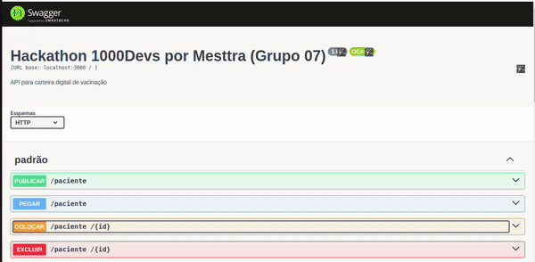

# API de Controle de Vacinação 
## Projeto Hackathon               
 Esta é uma API desenvolvida em Node.js para gerenciar informações relacionadas a pacientes, vacinas, campanhas de vacinação e períodos de aplicação. A API oferece operações básicas de CRUD (Create, Read, Update, Delete) para cada entidade, permitindo o rastreamento eficiente das vacinas aplicadas a cada paciente ao longo do tempo.
 
### Exemplos de Requisições



### Tecnologias Utilizadas
- Node.js: O backend da API foi desenvolvido em Node.js, proporcionando uma execução eficiente e escalável.
  
- Express: Utilizamos o framework Express para simplificar o desenvolvimento de rotas e middlewares.
 
- Swagger: A documentação da API foi gerada automaticamente com o Swagger, facilitando a compreensão e a interação com as rotas.

### Recursos Principais

 #### Pesquisa por ID:
- Endpoint: /pacientes/:id
- Método: GET
- Retorna informações detalhadas sobre o paciente com o ID fornecido.
  
 #### Pesquisa por Vacina:

- Endpoint: /vacinas/:nome
- Método: GET
- Retorna informações sobre a vacina com o nome fornecido.
  
#### Pesquisa por Campanha:

- Endpoint: /campanhas/:id
- Método: GET
- Retorna detalhes sobre a campanha de vacinação com o ID fornecido.

### Passo a Passo para Executar Localmente
 ```bash
 # clone o repositorio
 
- git clone git@github.com:bruna270498/Hackathon_Grupo07.git

# Instale as dependências

- npm install.

# Rode o comando para API

- npm run dev

# Acesse o Swagger

- http://localhost:3000/swagger-ui

```

### Agradecimentos

Agradecemos à Mesttra pela parceria e pela valiosa oportunidade de aplicar os conhecimentos e habilidades adquiridos no 1000Devs durante este estimulante hackathon de 32 horas. Foi uma experiência enriquecedora e mal podemos esperar por futuras colaborações! 🚀✨

### Autores
1. [Bruna Almeida](https://www.linkedin.com/in/bruna-almeida-soares/);
2. [John Peterson](https://www.linkedin.com/in/johnpeterson88/);
3. [Luciana Correa](https://www.linkedin.com/in/lucianacf/);
4. [Apolo Moraes](https://www.linkedin.com/in/apolomoraes/).
